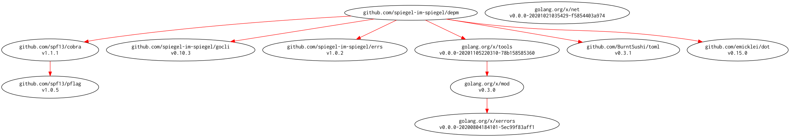
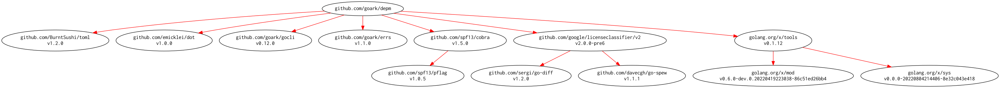

# [depm] -- Visualize depndency packages and modules

[](https://github.com/goark/depm/actions)
[](https://github.com/goark/depm/actions)
[](https://raw.githubusercontent.com/goark/depm/master/LICENSE)
[](https://github.com/goark/depm/releases/latest)

This package is required Go 1.16 or later.

**Migrated repository to [github.com/goark/depm][depm]**

## Download and Build

```
$ go install github.com/goark/depm@latest
```

### Binaries

See [latest release](https://github.com/goark/depm/releases/latest).

## Usage

```
$ depm -h
Visualize depndency packages and modules.

Usage:
  depm [flags]
  depm [command]

Available Commands:
  completion  Generate the autocompletion script for the specified shell
  help        Help about any command
  list        list modules
  module      analyze depndency modules
  package     analyze depndency packages
  version     print the version number

Flags:
      --cgo-enabled string   set CGO_ENABLED environment variable
      --debug                for debug
      --goarch string        set GOARCH environment variable
      --goos string          set GOOS environment variable
  -h, --help                 help for depm

Use "depm [command] --help" for more information about a command.
```

### Analyze Depndency Packages

```
$ depm package -h
analyze depndency packages.

Usage:
  depm package [flags] [package import path]

Aliases:
  package, pkg, p

Flags:
      --dot                 output by DOT language
      --dot-config string   config file for DOT language
  -h, --help                help for package
  -i, --include-internal    include internal packages
  -s, --include-standard    include standard Go library

Global Flags:
      --cgo-enabled string   set CGO_ENABLED environment variable
      --debug                for debug
      --goarch string        set GOARCH environment variable
      --goos string          set GOOS environment variable

$ cd /path/to/depm
$ depm package | jq .
[
  {
    "Package": {
      "ImportPath": "github.com/BurntSushi/toml",
      "Module": {
        "Path": "github.com/BurntSushi/toml",
        "Version": "v1.0.0",
        "License": "MIT"
      }
    }
  },
  {
    "Package": {
      "ImportPath": "github.com/emicklei/dot",
      "Module": {
        "Path": "github.com/emicklei/dot",
        "Version": "v0.16.0",
        "License": "MIT"
      }
    }
  },
...
```

### Analyze Depndency Modules

```
$ depm module -h
analyze depndency modules.

Usage:
  depm module [flags] [package import path]

Aliases:
  module, mod, m

Flags:
  -u, --check-update        check updating module
      --dot                 output by DOT language
      --dot-config string   config file for DOT language
  -h, --help                help for module
  -i, --include-internal    include internal packages

Global Flags:
      --cgo-enabled string   set CGO_ENABLED environment variable
      --debug                for debug
      --goarch string        set GOARCH environment variable
      --goos string          set GOOS environment variable

$ cd /path/to/depm
$ depm module | jq .
[
  {
    "Module": {
      "Path": "github.com/BurntSushi/toml@v1.0.0",
      "License": "MIT",
      "Packages": [
        "github.com/BurntSushi/toml"
      ]
    }
  },
  {
    "Module": {
      "Path": "github.com/emicklei/dot@v0.16.0",
      "License": "MIT",
      "Packages": [
        "github.com/emicklei/dot"
      ]
    }
  },
  ...
```

### Output DOT Language Format with Configuration File

```toml
[node]
  fontname = "Inconsolata"
[edge]
  color = "red"
```

```
$ cd /path/to/depm
$ depm module --dot --dot-config dotenc/sample.toml | dot -Tpng -o output.png
```

[](./output.png)

### Output List of Modules (compatible 'go list -m' command)

```
$ depm list -h
list modules, compatible 'go list -m' command

Usage:
  depm list [flags] [package import path]

Aliases:
  list, lst, l

Flags:
  -u, --check-update   check updating module
  -h, --help           help for list
  -j, --json           output by JSON format

Global Flags:
      --cgo-enabled string   set CGO_ENABLED environment variable
      --debug                for debug
      --goarch string        set GOARCH environment variable
      --goos string          set GOOS environment variable

$ cd /path/to/depm
$ depm list
github.com/BurntSushi/toml v1.0.0
github.com/emicklei/dot v0.16.0
github.com/goark/depm
github.com/goark/errs v1.1.0
github.com/goark/gocli v0.12.0
github.com/google/licenseclassifier v0.0.0-20210722185704-3043a050f148
github.com/sergi/go-diff v1.0.0
github.com/spf13/cobra v1.4.0
github.com/spf13/pflag v1.0.5
golang.org/x/mod v0.5.1
golang.org/x/sys v0.0.0-20211019181941-9d821ace8654
golang.org/x/tools v0.1.9
golang.org/x/xerrors v0.0.0-20200804184101-5ec99f83aff1
```

## Modules Requirement Graph

[](./dependency.png)

[depm]: https://github.com/goark/depm "goark/depm: Visualize depndency packages and modules"
