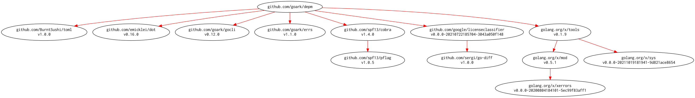

# [depm] -- Visualize depndency packages and modules

[](https://github.com/spiegel-im-spiegel/depm/actions)
[](https://github.com/spiegel-im-spiegel/depm/actions)
[](https://raw.githubusercontent.com/spiegel-im-spiegel/depm/master/LICENSE)
[](https://github.com/spiegel-im-spiegel/depm/releases/latest)

## Download and Build

```
$ go get github.com/spiegel-im-spiegel/depm@latest
```

### Binaries

See [latest release](https://github.com/spiegel-im-spiegel/depm/releases/latest).

## Usage

```
$ depm -h
$ go run main.go -h
Visualize depndency packages and modules.

Usage:
  depm [flags]
  depm [command]

Available Commands:
  help        Help about any command
  module      analyze depndency modules
  package     analyze depndency packages
  version     print the version number

Flags:
      --cgo-enabled string   set CGO_ENABLED environment variable
      --debug                for debug
      --dot                  output by DOT language
      --dot-config string    config file for DOT language
      --goarch string        set GOARCH environment variable
      --goos string          set GOOS environment variable
  -h, --help                 help for depm

Use "depm [command] --help" for more information about a command.
```

### Analyze depndency packages

```
$ depm package -h
analyze depndency packages.

Usage:
  depm package [flags] [package import path]

Aliases:
  package, pkg, p

Flags:
  -h, --help               help for package
  -i, --include-internal   include internal packages
  -s, --include-standard   include standard Go library

Global Flags:
      --cgo-enabled string   set CGO_ENABLED environment variable
      --debug                for debug
      --dot                  output by DOT language
      --dot-config string    config file for DOT language
      --goarch string        set GOARCH environment variable
      --goos string          set GOOS environment variable

$ depm package "github.com/spiegel-im-spiegel/depm" | jq .
[
  {
    "Package": {
      "ImportPath": "github.com/spf13/cobra",
      "Module": {
        "Path": "github.com/spf13/cobra",
        "Version": "v1.1.1"
      }
    },
    "Deps": [
      {
        "Package": {
          "ImportPath": "github.com/spf13/pflag",
          "Module": {
            "Path": "github.com/spf13/pflag",
            "Version": "v1.0.5"
          }
        }
      }
    ]
  },
...
```

### Analyze depndency packages

```
$ depm module -h
analyze depndency modules.

Usage:
  depm module [flags] [package import path]

Aliases:
  module, mod, m

Flags:
  -c, --check   check updating module
  -h, --help    help for module

Global Flags:
      --cgo-enabled string   set CGO_ENABLED environment variable
      --debug                for debug
      --dot                  output by DOT language
      --dot-config string    config file for DOT language
      --goarch string        set GOARCH environment variable
      --goos string          set GOOS environment variable

$ depm module "github.com/spiegel-im-spiegel/depm" | jq .
[
  {
    "Module": {
      "Path": "github.com/spf13/cobra@v1.1.1",
      "Packages": [
        "github.com/spf13/cobra"
      ]
    },
    "Deps": [
      {
        "Path": "github.com/spf13/pflag@v1.0.5",
        "Packages": [
          "github.com/spf13/pflag"
        ]
      }
    ]
  },
  ...
```


### Output DOT Language Format with Configuration File

```toml
[node]
  fontname = "Inconsolata"
[edge]
  color = "red"
```

```
$ depm module --dot --dot-config dotenc/sample.toml "github.com/spiegel-im-spiegel/depm" | dot -Tpng -o output.png
```

[](./output.png)


[depm]: https://github.com/spiegel-im-spiegel/depm "spiegel-im-spiegel/depm: Visualize depndency packages and modules"
