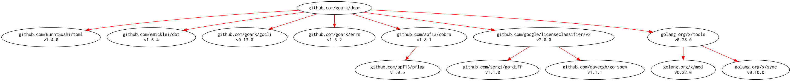

# [depm] -- Visualize depndency packages and modules

[](https://github.com/spiegel-im-spiegel/depm/actions)
[](https://github.com/spiegel-im-spiegel/depm/actions)
[](https://raw.githubusercontent.com/spiegel-im-spiegel/depm/master/LICENSE)
[](https://github.com/spiegel-im-spiegel/depm/releases/latest)

This package is required Go 1.16 or later.

## Download and Build

```
$ go install github.com/spiegel-im-spiegel/depm@latest
```

### Binaries

See [latest release](https://github.com/spiegel-im-spiegel/depm/releases/latest).

## Usage

```
$ depm -h
Visualize depndency packages and modules.

Usage:
  depm [flags]
  depm [command]

Available Commands:
  help        Help about any command
  list        list modules
  module      analyze depndency modules
  package     analyze depndency packages
  version     print the version number

Flags:
      --cgo-enabled string   set CGO_ENABLED environment variable
      --debug                for debug
      --goarch string        set GOARCH environment variable
      --goos string          set GOOS environment variable
  -h, --help                 help for depm

Use "depm [command] --help" for more information about a command.
```

### Analyze Depndency Packages

```
$ depm package -h
analyze depndency packages.

Usage:
  depm package [flags] [package import path]

Aliases:
  package, pkg, p

Flags:
      --dot                 output by DOT language
      --dot-config string   config file for DOT language
  -h, --help                help for package
  -i, --include-internal    include internal packages
  -s, --include-standard    include standard Go library

Global Flags:
      --cgo-enabled string   set CGO_ENABLED environment variable
      --debug                for debug
      --goarch string        set GOARCH environment variable
      --goos string          set GOOS environment variable

$ depm package "github.com/spiegel-im-spiegel/depm" | jq .
[
  {
    "Package": {
      "ImportPath": "github.com/google/licenseclassifier",
      "Module": {
        "Path": "github.com/google/licenseclassifier",
        "Version": "v0.0.0-20210324205846-148b633b0534",
        "License": "Apache-2.0"
      }
    },
    "Deps": [
      {
        "ImportPath": "github.com/google/licenseclassifier/stringclassifier",
        "Module": {
          "Path": "github.com/google/licenseclassifier",
          "Version": "v0.0.0-20210324205846-148b633b0534",
          "License": "Apache-2.0"
        }
      },
      {
        "ImportPath": "github.com/google/licenseclassifier/stringclassifier/searchset",
        "Module": {
          "Path": "github.com/google/licenseclassifier",
          "Version": "v0.0.0-20210324205846-148b633b0534",
          "License": "Apache-2.0"
        }
      }
    ]
  },
...
```

### Analyze Depndency Modules

```
$ depm module -h
analyze depndency modules.

Usage:
  depm module [flags] [package import path]

Aliases:
  module, mod, m

Flags:
  -u, --check-update        check updating module
      --dot                 output by DOT language
      --dot-config string   config file for DOT language
  -h, --help                help for module
  -i, --include-internal    include internal packages

Global Flags:
      --cgo-enabled string   set CGO_ENABLED environment variable
      --debug                for debug
      --goarch string        set GOARCH environment variable
      --goos string          set GOOS environment variable

$ depm module "github.com/spiegel-im-spiegel/depm" | jq .
[
  {
    "Module": {
      "Path": "github.com/google/licenseclassifier@v0.0.0-20210324205846-148b633b0534",
      "License": "Apache-2.0",
      "Packages": [
        "github.com/google/licenseclassifier",
        "github.com/google/licenseclassifier/stringclassifier",
        "github.com/google/licenseclassifier/stringclassifier/searchset",
        "github.com/google/licenseclassifier/stringclassifier/searchset/tokenizer"
      ]
    },
    "Deps": [
      {
        "Path": "github.com/sergi/go-diff@v1.0.0",
        "License": "MIT",
        "Packages": [
          "github.com/sergi/go-diff/diffmatchpatch"
        ]
      }
    ]
  },
  ...
```

### Output DOT Language Format with Configuration File

```toml
[node]
  fontname = "Inconsolata"
[edge]
  color = "red"
```

```
$ depm module --dot --dot-config dotenc/sample.toml "github.com/spiegel-im-spiegel/depm" | dot -Tpng -o output.png
```

[](./output.png)

### Output List of Modules (compatible 'go list -m' command)

```
$ depm list -h
list modules, compatible 'go list -m' command

Usage:
  depm list [flags] [package import path]

Aliases:
  list, lst, l

Flags:
  -u, --check-update   check updating module
  -h, --help           help for list
  -j, --json           output by JSON format

Global Flags:
      --cgo-enabled string   set CGO_ENABLED environment variable
      --debug                for debug
      --goarch string        set GOARCH environment variable
      --goos string          set GOOS environment variable

$ depm list -u "github.com/spiegel-im-spiegel/depm"
github.com/BurntSushi/toml v0.3.1
github.com/emicklei/dot v0.15.0
github.com/google/licenseclassifier v0.0.0-20210324205846-148b633b0534
github.com/sergi/go-diff v1.0.0 [v1.1.0]
github.com/spf13/cobra v1.1.3
github.com/spf13/pflag v1.0.5
github.com/spiegel-im-spiegel/depm
github.com/spiegel-im-spiegel/errs v1.0.2
github.com/spiegel-im-spiegel/gocli v0.10.4
golang.org/x/mod v0.3.0 [v0.4.2]
golang.org/x/net v0.0.0-20201021035429-f5854403a974 [v0.0.0-20210324205630-d1beb07c2056]
golang.org/x/sys v0.0.0-20210119212857-b64e53b001e4 [v0.0.0-20210324051608-47abb6519492]
golang.org/x/tools v0.1.0
golang.org/x/xerrors v0.0.0-20200804184101-5ec99f83aff1
```

## Modules Requirement Graph

[](./dependency.png)

[depm]: https://github.com/spiegel-im-spiegel/depm "spiegel-im-spiegel/depm: Visualize depndency packages and modules"
